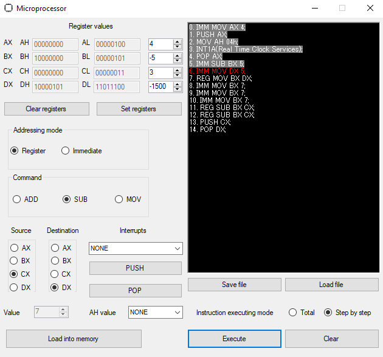

# Microprocessor-Simulator

Main project's aim is to simulate 16-bit microprocessor actions.  
Microprocessor consists of four 16-bit registers:
<ul>
  <li>AX (AH, AL)</li>
  <li>BX (BH, BL)</li>
  <li>CX (CH, CL)</li>
  <li>DX (DH, DL)</li>
</ul>
Application can simulate operations like ADD, SUB and MOV in the either addressing or immediate mode. 
User can choose source and destination registers in order to add value to preferable register. 
Interrupts are carried out using stack. All of them are BIOS interrupt calls. Below it's shown which AH value corresponds with given interrupt.  
<table>
  <tr>
    <th> Interrupts vector </th>
    <th> AH value </th>
    <th> Description </th>
  </tr>
  <tr>  
    <th> INT 10 (Video Services) </th>
    <th> 03h </th>
    <th> Read cursor position </th>
  </tr>
   <tr>  
    <th> INT 13 (Low Level Disk Services) </th>
    <th> 01h </th>
    <th> Check drive status </th>
  </tr>
  <tr>
    <th> INT 14 (Serial Port Services) </th>
    <th> 03h </th>
    <th> Check port status </th>
  </tr> 
  <tr>  
    <th> INT 16 (Keyboard Services) </th>
    <th> 00h </th>
    <th> Read keyboard char and store it to register </th>
  </tr> 
  <tr>  
    <th> INT 17 (Printer Services) </th>
    <th> 02h </th>
    <th> Check printer status </th>
  </tr> 
  <tr>  
    <th> INT 19 </th>
    <th> - </th>
    <th> Reboot system </th>
  </tr>
  <tr>
    <th> INT 1A </th>
    <th> 00h </th>
    <th> Read RTC </th>
  </tr>
   <tr>
    <th> INT 1A </th>
    <th> 02h </th>
    <th> Read RTC time </th>
  </tr> 
  <tr>
    <th> INT 1A </th>
    <th> 04h </th>
    <th> Read RTC date </th>
  </tr> 
  <tr>  
    <th> INT 20 </th>
    <th> - </th>
    <th> Shut down system </th>
  </tr>
</table>
In order to save value into memory press PUSH button and in order to load saved value from the top of the stack press POP button and choose destination register.    
Application enables user to load commands from file or save them to it. 
There's also a possibility to execute all commands at once or execute them step by step. 
All commands added into memory are displayed in the black textbox.    
Overview:  

